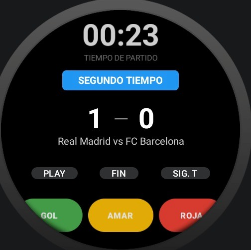
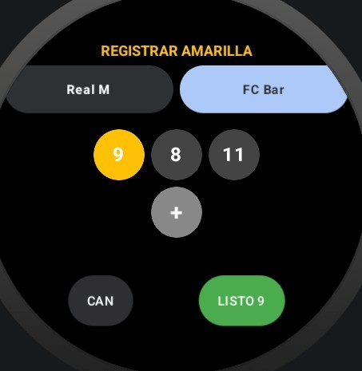

#   Tracker de Partidos para Wear OS

  
  
  
  
  
  

**El Proyecto** es una solución integral para la gestión de partidos de fútbol en tiempo real, diseñada específicamente para el ecosistema **Wear OS**. Permite a árbitros y aficionados registrar cada incidente del encuentro directamente desde su muñeca, sincronizando los datos con un backend robusto.

---

##  Características Principales

- **️ Cronómetro Inteligente:** Control total del tiempo de juego (pausa, reanudación y cambio de periodos).
- ** Marcador en Vivo:** Registro instantáneo de goles para local y visitante.
- ** Gestión de Sanciones:** Registro rápido de tarjetas amarillas y rojas.
- ** Historial de Eventos:** Consulta todos los sucesos del partido cronológicamente.
- ** Sincronización Real-time:** Conexión con API REST para persistencia en la nube.
- ** UI Optimizada:** Interfaz adaptada para pantallas circulares y cuadradas con Jetpack Compose.

---

## Algunas Capturas de Pantalla -- No son Todas ---

---

##  Stack Tecnológico

### **Frontend (Mobile/Wearable)**
- **Kotlin:** Lenguaje de última generación para Android.
- **Jetpack Compose for Wear OS:** UI declarativa y moderna.
- **Room Persistence:** Caché local para funcionamiento offline.
- **Retrofit & OkHttp:** Comunicación eficiente con la API.

### **Backend & Base de Datos**
- **Node.js:** Entorno de ejecución para el servidor.
- **Express:** Framework para la creación de la API REST.
- **MongoDB:** Base de datos NoSQL para almacenamiento flexible de encuentros.

---

##  Instalación y Configuración

1. **Backend:** Asegúrate de tener el servidor Node.js corriendo (por defecto en el puerto `3000`).
2. **Clonación:** `git clone https://github.com/tu-usuario/fulbito.git`
3. **Android Studio:** Abre el proyecto y sincroniza Gradle.
4. **Configuración de IP:** Si usas un dispositivo físico, cambia `BASE_URL` en `RetrofitClient.kt` por la IP de tu servidor.
5. **Ejecución:** Selecciona un emulador de Wear OS o un reloj físico y presiona `Run`.

---

  <i>Desarrollado para el proyecto de la UTNG_Chavez Piñón Santiago Ronaldo_González Avalos César Fernando_Torres Perez Leonel Alejandro</i>

  <i>Grupo GIDS6093</i>

