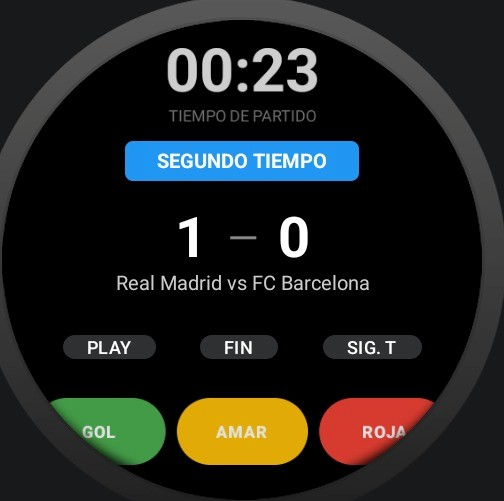

# Tracker de Partidos - Fulbito 360

<p align="center">
  
  
  
  
  
  
  
  
</p>

---

##  Código Fuente Completo 

> El documento con **absolutamente todo el código fuente del frontend** (línea 1 hasta la última, con todos los comentarios) se encuentra en el siguiente archivo:
>
> **[CODIGO_COMPLETO.pdf](https://drive.google.com/file/d/1fhmGZ7sfFKE-7U0vWxAlfZn9sUt4mTyx/view?usp=sharing)**
>
> Incluye los módulos:
> - `fulbitoapp` — App Móvil Android (Jetpack Compose)
> - `fulbitotv` — App Android TV (Jetpack Compose TV)
> - `app` — App Wear OS (Reloj Inteligente)
>
> **Fulbito 360**

---

**Fulbito** es una solución integral y distribuida para la gestión de partidos de fútbol en tiempo real, diseñada específicamente para funcionar en perfecta sincronía a través del ecosistema **Wear OS, Android Móvil y Android TV**. 

### Beneficiario del Proyecto
Esta aplicación está dirigida a **Ligas de fútbol amateur, árbitros, capitanes de equipo y aficionados**. 
Resuelve la ineficiencia de la gestión manual de los partidos proporcionando un flujo digital donde:
- **El árbitro** controla el partido sin sacar el celular, directamente desde su muñeca.
- **Los administradores y jugadores** revisan el rendimiento, las tarjetas y los goles en su teléfono.
- **Los espectadores** viven la experiencia visualizando el marcador del estadio actualizado en vivo desde una pantalla grande.

---

## Diagrama de Arquitectura de Sistemas

El flujo de información de la aplicación es impulsado por eventos de baja latencia a través de WebSockets:


```mermaid
graph TD
    A[Sensor/Reloj Wear OS\nControl del Partido] -->|HTTP POST: Registra Goles/Tarjetas| B[Backend Node.js\nAPI REST & Socket.io]
    B -->|WebSocket: Emite 'match_event' y 'match_updated'| C[Teléfono\nApp Admin y Jugador]
    B -->|WebSocket: Emite 'match_updated'| D[Android TV / Cast\nMarcador en Vivo]
    C -->|HTTP GET/POST: CRUD de Ligas y Equipos| B
    B <-->|Mongoose ODM| E[(MongoDB\nAlmacenamiento Persistente)]
```

---

## Características Principales

- **Cronómetro Inteligente (Wear OS):** Control total del tiempo de juego (pausa, reanudación, cambio de periodos y término del partido) optimizado para bajo consumo de batería.
- **Marcador y Eventos en Vivo:** Registro instantáneo de goles, tarjetas amarillas y rojas con asociación directa a jugadores y equipos.
- **Notificaciones Push Locales:** El teléfono recibe alertas nativas instantáneas vía Socket.io cuando ocurre un gol o el árbitro expulsa a un jugador en el campo.
- **Radar de Rendimiento:** Gráficos de estadísticas dibujados dinámicamente (`Canvas`) para los jugadores, evaluando goles, tarjetas y participación.
- **Gestión de Multimedia:** Subida de escudos y logotipos al servidor usando peticiones `Multipart`.

---

<div align="center">

## Capturas de Pantalla (Ecosistema)

<p align="center">
  <b>Interfaz Wear OS (Reloj Árbitro)</b><br>
  
  
  
</p>

<p align="center">
  <b>App Móvil (Teléfono Admin/Jugador)</b><br>
  
  
  
</p>

<p align="center">
  <b>Android TV (Marcador en Vivo)</b><br>
  
</p>

</div>

---

## Estructura del Proyecto Frontend (Árbol de Carpetas y Archivos .kt)

El proyecto Android es un proyecto multi-módulo que separa claramente la lógica de cada tipo de dispositivo. A continuación, el árbol idéntico a la estructura real del código fuente:

```text
Fulbito/
├── app/src/main/java/mx/utng/srcp/fulbito/          (MÓDULO WEAR OS)
│   ├── data/
│   │   ├── local/
│   │   │   ├── AppDatabase.kt
│   │   │   └── Converters.kt
│   │   ├── dao/
│   │   │   └── MatchDao.kt
│   │   ├── entity/
│   │   │   ├── EventEntity.kt
│   │   │   ├── MatchEntity.kt
│   │   │   └── PlayerEntity.kt
│   │   ├── remote/
│   │   │   ├── ApiService.kt
│   │   │   └── RetrofitClient.kt
│   │   └── repository/
│   │       └── MatchRepository.kt
│   └── presentation/
│       ├── MainActivity.kt
│       ├── MainViewModel.kt
│       ├── screens/
│       │   ├── CommonUI.kt
│       │   ├── DashboardScreen.kt
│       │   ├── EditEventScreen.kt
│       │   ├── EventLogScreen.kt
│       │   ├── EventRegistrationScreen.kt
│       │   ├── MatchSelectionScreen.kt
│       │   └── WelcomeScreen.kt
│       └── theme/
│           └── Theme.kt
│
├── fulbitoapp/src/main/java/mx/utng/cfga/fulbitoapp/  (MÓDULO TELÉFONO)
│   ├── MainActivity.kt
│   ├── data/remote/
│   │   ├── ApiConfig.kt
│   │   ├── ApiService.kt
│   │   ├── AuthModels.kt
│   │   ├── Models.kt
│   │   └── SocketManager.kt
│   ├── presentation/
│   │   ├── AdminViewModel.kt
│   │   ├── LoginViewModel.kt
│   │   ├── PlayerViewModel.kt
│   │   ├── navigation/
│   │   │   └── AppNavigation.kt
│   │   └── screens/
│   │       ├── AdminDashboardScreen.kt
│   │       ├── AdminMatchScreen.kt
│   │       ├── AdminPlayerScreen.kt
│   │       ├── AdminTeamScreen.kt
│   │       ├── AppColors.kt
│   │       ├── LeagueSelectionScreen.kt
│   │       ├── LoginScreen.kt
│   │       ├── PlayerDashboardScreen.kt
│   │       └── PlayerProfileScreen.kt
│   └── util/
│       └── FulbitoNotificationService.kt
│
└── fulbitotv/src/main/java/mx/utng/srcp/fulbitotv/    (MÓDULO ANDROID TV)
    ├── MainActivity.kt
    ├── data/remote/
    │   ├── ApiService.kt
    │   └── Models.kt
    ├── presentation/
    │   ├── TvViewModel.kt
    │   └── screens/
    │       ├── TvLiveScoreScreen.kt
    │       └── TvWaitingScreen.kt
    └── ui/theme/
        ├── Color.kt
        ├── Theme.kt
        └── Type.kt
```

## Función y Detalle de Todos los Archivos Críticos del Frontend

A continuación, se detalla la responsabilidad de todos los archivos Kotlin más críticos que componen la arquitectura MVVM de la plataforma:

### Capa de Datos (Data y Red)
| Archivo | Ubicación Módulo | Descripción / Función Principal |
|---------|------------------|--------------------------------|
| `ApiService.kt` | `data/remote/` | Interfaz maestra de Retrofit. Define más de 15 endpoints HTTP (GET, POST, PUT, DELETE) con subida en Multipart. |
| `SocketManager.kt` | `data/remote/` | Clase Singleton encargada de abrir la conexión bidireccional de WebSockets (`socket.io-client`) y emitir *callbacks* de Kotlin ante eventos como `match_event`. |
| `ApiConfig.kt` | `data/remote/` | Objeto estático (Singleton) que define la dirección IP de host y el puerto centralizado para evitar hardcoding en la app. |
| `Models.kt` | `data/remote/` | Data classes (DTOs) que representan Ligas, Equipos, Jugadores y Partidos devueltos por MongoDB. |
| `AuthModels.kt` | `data/remote/` | Contiene los esquemas JSON de las peticiones y respuestas para el control de inicio de sesión (`AuthRequest`, `AuthResponse`). |

### Capa de Estado y Navegación (ViewModels y Utils)
| Archivo | Ubicación Módulo | Descripción / Función Principal |
|---------|------------------|--------------------------------|
| `AppNavigation.kt` | `presentation/` | Componente central `NavHost`. Inyecta ViewModels de manera reactiva y gestiona el enrutamiento (`NavGraph`) pasando argumentos seguros. |
| `AdminViewModel.kt` | `presentation/` | Gestiona el estado y caché del Administrador (Equipos, Jugadores, Ligas) exponiendo `StateFlow`. Llama corrutinas al backend (`reloadAll`, `uploadImage`). |
| `PlayerViewModel.kt` | `presentation/` | Maneja el estado individual de un jugador autenticado (descarga estadísticas, próximos partidos, info de capitanía). |
| `LoginViewModel.kt` | `presentation/` | Controla los flujos de texto del Login y despacha la mutación segura de inicio de sesión con encriptación. |
| `FulbitoNotificationService.kt`| `util/` | Interfaz nativa de Android que instancia canales de `NotificationManager` para mostrar alertas push en el móvil. |

### Capa de Vistas (Jetpack Compose Screens)
| Archivo | Ubicación Módulo | Descripción / Función Principal |
|---------|------------------|--------------------------------|
| `LoginScreen.kt` | `screens/` | Pantalla de bienvenida. Autentica las credenciales con el Backend antes de enrutar a las pantallas protegidas. |
| `LeagueSelectionScreen.kt` | `screens/` | Panel del administrador para seleccionar o crear el torneo actual y filtrar los equipos. |
| `AdminDashboardScreen.kt` | `screens/` | Menú interactivo central del Administrador que dirige a la gestión de Torneos, Partidos, Equipos y Jugadores. |
| `AdminTeamScreen.kt` | `screens/` | Realiza el CRUD de Equipos y envía los archivos Multipart (logos) seleccionados mediante el `ContentResolver`. |
| `AdminPlayerScreen.kt` | `screens/` | Registra a los jugadores asociándolos directamente a un Equipo y asignándoles un dorsal. |
| `AdminMatchScreen.kt` | `screens/` | Calendariza los encuentros, indicando qué Equipos se enfrentan y a qué hora para sincronizarlo al reloj. |
| `PlayerDashboardScreen.kt` | `screens/` | Vista general del Jugador con información de su próximo partido y un panel especial si tiene el rol de Capitán. |
| `PlayerProfileScreen.kt` | `screens/` | Analiza el desempeño del Jugador mediante algoritmos matemáticos en un lienzo `Canvas`, dibujando un radar de goles y tarjetas. |

---

## Código y Lógica Principal por Dispositivo (Extractos Completos y Funcionales)

### 1. App Móvil (Teléfono) - Inyección de Socket.io y Sistema de Notificaciones
En la aplicación móvil, nos conectamos vía WebSockets para obtener una experiencia fluida sin necesidad de recargar la pantalla manualmente. A continuación, el flujo real dentro del `AdminViewModel.kt` que combina Kotlin StateFlow con el cliente Socket.io:

```kotlin
/**
 * Conecta el dispositivo al servidor WebSocket local y se suscribe a los canales de eventos.
 * Si ocurre un evento crítico durante un partido (Ej. "GOL"), 
 * dispara de inmediato la notificación push nativa hacia el sistema operativo.
 */
fun connectSocket(matchId: String, context: Context) {
    viewModelScope.launch {
        try {
            SocketManager.connect()
            
            // Callback asíncrono para interceptar el evento 'match_event' emitido por el Reloj
            SocketManager.onMatchEvent { event ->
                if (event.matchId == matchId) {
                    // Muta el StateFlow para obligar a Jetpack Compose a repintar la UI del tablero de goles
                    _eventosPartido.value = _eventosPartido.value + event
                    
                    // Evaluamos el tipo de evento para lanzar alertas críticas
                    when (event.type) {
                        "GOL" -> {
                            FulbitoNotificationService.showNotification(
                                context = context,
                                title = "¡GOL EN VIVO! ⚽",
                                message = "El marcador se acaba de actualizar."
                            )
                        }
                        "TARJETA ROJA" -> {
                            FulbitoNotificationService.showNotification(
                                context = context,
                                title = "Expulsión Registrada 🟥",
                                message = "Un jugador acaba de recibir tarjeta roja directa."
                            )
                        }
                    }
                }
            }
        } catch (e: Exception) {
            Log.e("AdminViewModel", "Error al inicializar Socket.io: ${e.message}")
        }
    }
}
```

### 2. App Wear OS (Reloj Árbitro) - Persistencia del Cronómetro y Envío de Goles
El Wear OS es el cerebro del partido. No solo emite los goles a la base de datos REST, sino que ejecuta una corrutina incesante que funciona como cronómetro en tiempo real. Esta corrutina es totalmente independiente del ciclo de vida de la pantalla (funciona incluso si la pantalla se apaga).

```kotlin
/**
 * Lanza una corrutina incesante que incrementa el contador de partido cada segundo.
 * Evita la destrucción del estado gracias a viewModelScope y el delegador de Job.
 */
fun startTimer() {
    // Si ya existe un timer corriendo en un contexto anterior, lo cancelamos antes de reiniciar
    timerJob?.cancel()
    
    timerJob = viewModelScope.launch(Dispatchers.Default) {
        while (isActive) {
            delay(1000L) // Pausa asíncrona no bloqueante
            
            // Solo aumentamos el tiempo si el partido está en juego (ni pausado ni en medio tiempo)
            if (!isPaused.value && !isHalfTime.value) {
                _elapsedTime.value += 1
                
                // Realizamos respaldos de tiempo automáticos al servidor (Sync cada 60s)
                if (_elapsedTime.value % 60 == 0) {
                    syncTimeWithServer(matchId)
                }
            }
        }
    }
}

/**
 * Mutación del marcador. Actualizamos MongoDB con Retrofit.
 * Automáticamente, Node.js atrapará este cambio y lo transmitirá por Socket.io a la TV y Teléfonos.
 */
fun updateMatchStatus(matchId: String, isFinished: Boolean = false) {
    viewModelScope.launch {
        try {
            api.updateMatchStatus(
                id = matchId,
                status = MatchStatusUpdate(
                    homeScore = homeScore.value,
                    awayScore = awayScore.value,
                    elapsedTime = elapsedTime.value,
                    isFinished = isFinished
                )
            )
            Log.d("WearOS", "Sincronización de Score Exitosa: ${homeScore.value} - ${awayScore.value}")
        } catch (e: Exception) {
            _errorState.value = "Fallo de red en el estadio. Imposible actualizar base de datos."
            Log.e("WearOS", "Error HTTP: ${e.message}")
        }
    }
}
```

### 3. Android TV (Pantalla) - Escucha Activa sin Interacción (Solo Lectura)
La televisión carece de botones de interacción; actúa como un cliente silencioso que reacciona pasivamente a los "Pings" (Socket Pushes) del servidor para refrescar todo su StateFlow visual de inmediato.

```kotlin
/**
 * Bucle de escucha infinita para la televisión, optimizado con Dispatchers.IO 
 * para evitar bloqueos del hilo principal al redibujar UI grandes.
 */
fun listenToMatchUpdates(matchId: String) {
    SocketManager.connect()
    
    // Suscripción de baja latencia al canal 'match_updated' de WebSocket
    SocketManager.onMatchUpdated { updatedMatchId ->
        
        // Verificamos que el evento emitido corresponda al partido que está renderizando la TV
        if (updatedMatchId == matchId) {
            viewModelScope.launch(Dispatchers.IO) {
                try {
                    // Descarga REST de los datos más recientes (Gol, Tarjeta o Cambio de Tiempo)
                    val freshData = api.getMatchDetails(matchId)
                    
                    // Mutamos el StateFlow en el Thread principal (Main) para actualizar Compose
                    withContext(Dispatchers.Main) {
                        _matchDetails.value = freshData.partido
                        _eventosPartido.value = freshData.eventos
                        Log.d("AndroidTV", "Marcador de TV actualizado a través de Socket.io")
                    }
                } catch (e: Exception) {
                    Log.e("TvViewModel", "Error al repintar marcador en TV: ${e.message}")
                }
            }
        }
    }
### 4. Capa de Red y Multi-part (Retrofit)
`ApiService.kt` centraliza todas las peticiones asíncronas al Backend usando Kotlin Coroutines (`suspend fun`), permitiendo subir incluso fotografías y escudos binarios vía `MultipartBody`.
```kotlin
interface ApiService {
    // Endpoints REST tradicionales
    @GET("matches")
    suspend fun getMatches(@Query("leagueId") leagueId: String? = null): List<Match>
    
    @POST("auth/login")
    suspend fun login(@Body request: AuthRequest): AuthResponse

    // Subida asíncrona de archivos multimedia (Logos/Fotos)
    @Multipart
    @POST("upload")
    suspend fun uploadImage(@Part image: MultipartBody.Part): UploadResponse
}
```

### 5. Renderizado Dinámico de Gráficas en Jetpack Compose
El `PlayerProfileScreen.kt` no utiliza librerías externas para gráficas. Analiza las métricas y dibuja geométricamente el "Radar de Rendimiento" mediante el API nativa de `Canvas` de Compose.
```kotlin
@Composable
fun RadarChart(
    values: List<Float>, // Valores normalizados (0f a 1f)
    labels: List<String>,
    modifier: Modifier = Modifier
) {
    val textMeasurer = rememberTextMeasurer() // API oficial de Compose para Textos en Canvas
    
    Canvas(modifier = modifier) {
        val cx = size.width / 2f
        val cy = size.height / 2f
        val radius = (size.minDimension / 2f) * 0.60f
        val angleStep = (2 * Math.PI / values.size).toFloat()
        
        // Función matemática para calcular vértices
        fun vertexAt(level: Float, i: Int): Offset {
            val angle = -Math.PI.toFloat() / 2f + i * angleStep
            return Offset(
                cx + level * radius * kotlin.math.cos(angle),
                cy + level * radius * kotlin.math.sin(angle)
            )
        }

        // Trazado del Polígono de Rendimiento
        val dataPath = Path()
        for (i in values.indices) {
            val v = vertexAt(values[i].coerceIn(0f, 1f), i)
            if (i == 0) dataPath.moveTo(v.x, v.y) else dataPath.lineTo(v.x, v.y)
        }
        dataPath.close()
        
        // Pintamos el relleno translúcido y los bordes curvos
        drawPath(path = dataPath, color = Color.Green.copy(alpha = 0.18f))
        drawPath(path = dataPath, color = Color.Green, style = Stroke(width = 2.5f))
    }
}
```

### 6. Sistema de Notificaciones Push Nativas
El `FulbitoNotificationService.kt` se encarga de crear el canal de notificaciones en el OS y disparar alertas silenciosas o ruidosas en el teléfono cuando el WebSocket atrapa una tarjeta roja o un gol.
```kotlin
object FulbitoNotificationService {
    private const val CHANNEL_ID = "fulbito_live_channel"

    fun showNotification(context: Context, title: String, message: String) {
        val notificationManager = context.getSystemService(Context.NOTIFICATION_SERVICE) as NotificationManager

        // Creación del Canal (Obligatorio en Android Oreo+)
        if (Build.VERSION.SDK_INT >= Build.VERSION_CODES.O) {
            val channel = NotificationChannel(
                CHANNEL_ID,
                "Eventos de Partido en Vivo",
                NotificationManager.IMPORTANCE_HIGH
            ).apply {
                description = "Notificaciones instantáneas de goles y tarjetas"
            }
            notificationManager.createNotificationChannel(channel)
        }

        val notification = NotificationCompat.Builder(context, CHANNEL_ID)
            .setSmallIcon(android.R.drawable.ic_dialog_info)
            .setContentTitle(title)
            .setContentText(message)
            .setPriority(NotificationCompat.PRIORITY_HIGH)
            .build()

        notificationManager.notify(System.currentTimeMillis().toInt(), notification)
    }
}
```

### 7. Manejo de Estados y Mutabilidad (LoginViewModel)
El `LoginViewModel.kt` demuestra el correcto uso de la inmutabilidad exponiendo flujos seguros (`StateFlow`) hacia la UI y encriptando/validando credenciales en Background threads.
```kotlin
class LoginViewModel : ViewModel() {
    private val api = RetrofitInstance.getApi()

    // Solo el ViewModel puede mutar el estado
    private val _user = MutableStateFlow<User?>(null)
    // Compose solo puede observar esta versión de solo-lectura
    val user: StateFlow<User?> = _user.asStateFlow()

    fun login(username: String, pass: String, onError: (String) -> Unit) {
        viewModelScope.launch {
            try {
                // Suspende la corrutina hasta que el servidor devuelva el Token JWT o responda
                val res = api.login(AuthRequest(username, pass))
                _user.value = res.user
            } catch (e: Exception) {
                onError("Credenciales incorrectas o servidor caído")
            }
        }
    }
}
```

### 8. Gestor Global de WebSockets (SocketManager)
El `SocketManager.kt` actúa como la capa de persistencia bidireccional. Se autogestiona para no multiplicar conexiones infinitas y retransmite lambdas tipadas a quien las suscriba.
```kotlin
object SocketManager {
    private var socket: Socket? = null

    fun connect() {
        if (socket == null) {
            val opts = IO.Options()
            opts.forceNew = true
            socket = IO.socket(ApiConfig.BASE_URL.replace("/api", ""), opts)
            socket?.connect()
        }
    }

    // Escucha eventos del backend Node.js, parseando JSONs puros a Gson/Kotlin
    fun onMatchEvent(callback: (EventEntity) -> Unit) {
        socket?.on("match_event") { args ->
            if (args.isNotEmpty()) {
                val dataStr = args[0].toString()
                val event = Gson().fromJson(dataStr, EventEntity::class.java)
                callback(event)
            }
        }
    }
}
```

### 9. Navegación Segura en Jetpack Compose
El `AppNavigation.kt` instancializa y comparte los ViewModels (para que retengan su memoria RAM durante cambios de pantalla) y enruta la UI usando NavController.
```kotlin
@Composable
fun AppNavigation(isDarkMode: Boolean, onToggleDarkMode: () -> Unit) {
    val navController = rememberNavController()
    
    // Estos ViewModels viven mientras exista el NavHost
    val loginViewModel: LoginViewModel = viewModel()
    val adminViewModel: AdminViewModel = viewModel()
    val playerViewModel: PlayerViewModel = viewModel()

    NavHost(navController = navController, startDestination = "login") {
        composable("login") {
            LoginScreen(navController, loginViewModel, isDarkMode, onToggleDarkMode)
        }
        composable("admin_dashboard") {
            AdminDashboardScreen(navController, loginViewModel, isDarkMode, onToggleDarkMode)
        }
        composable("player_dashboard") {
            PlayerDashboardScreen(navController, loginViewModel, playerViewModel)
        }
        // Pasando parámetros en las rutas (ej. teamId)
        composable("admin_team?teamId={teamId}") { backStackEntry ->
            val teamId = backStackEntry.arguments?.getString("teamId")
            AdminTeamScreen(navController, adminViewModel, teamId)
        }
    }
}
```

---

## Stack Tecnológico

El proyecto está diseñado usando los paradigmas más modernos de desarrollo móvil (Programación Declarativa y Arquitectura Unidireccional).

### Frontend (Mobile, Wearable & TV)
- **Kotlin:** Lenguaje principal 100% moderno y seguro contra nulos.
- **Arquitectura MVVM:** Separación limpia de la vista y la lógica de negocio (Model-View-ViewModel).
- **Jetpack Compose:** Interfaz gráfica 100% declarativa para los tres dispositivos (Mobile, Wear OS y TV).
- **Corrutinas y StateFlow:** Manejo asíncrono avanzado y estado reactivo.
- **Retrofit & OkHttp:** Cliente HTTP seguro para el consumo de la API REST y subida Multipart.
- **Socket.io Client:** Conexión persistente por WebSockets para el tiempo real.
- **Coil:** Carga de imágenes asíncronas optimizada por caché en disco y memoria.

### Backend & Base de Datos
- **Node.js + Express:** Servidor web rápido, no bloqueante y ligero.
- **Socket.io:** Motor de eventos bidireccional de baja latencia.
- **MongoDB + Mongoose:** Base de datos NoSQL flexible, ideal para esquemas de torneos.
- **Bcrypt:** Encriptación de contraseñas por seguridad.

---

## Instalación y Configuración Detallada

Para ejecutar este ecosistema localmente, necesitas **Node.js**, **MongoDB** y **Android Studio**.

### Paso 1: Levantar el Backend (Servidor)
1. Abre una terminal y navega a la carpeta del servidor: 
   ```bash
   cd fulbito-backend
   ```
2. Instala las dependencias necesarias:
   ```bash
   npm install
   ```
3. Ejecuta el servidor (por defecto en el puerto `3000`):
   ```bash
   npm run dev
   ```
   *(Asegúrate de tener el servicio de MongoDB corriendo localmente o proporciona una URI de Mongo Atlas en tu código).*

### Paso 2: Configurar el Frontend (Android)
1. Abre **Android Studio**.
2. Selecciona *Open* y elige la carpeta `fulbit-F/Fulbito/`.
3. Espera a que Gradle sincronice todas las librerías.
4. **Configuración Crítica de Red:** 
   - Ve al archivo `ApiConfig.kt` (ubicado dentro de la carpeta `data/remote/` de cada módulo).
   - Cambia la variable `BASE_URL` por la **dirección IP real de tu computadora** en tu red Wi-Fi (Ej: `http://192.168.1.11:3000/api`). *Nunca dejes localhost si vas a probar en dispositivos físicos.*

### Paso 3: Compilación y Ejecución
- En la barra superior de Android Studio, encontrarás un menú desplegable de "Run Configurations".
- Selecciona el módulo que deseas probar (`app`, `fulbitoapp`, o `fulbitotv`).
- Selecciona el emulador adecuado o conecta tu celular/reloj por cable o depuración inalámbrica.
- Presiona **Run**.

---
<p align="center">
  <i>Desarrollado para el proyecto final de cuatrimestre por:</i><br>
  <b>Santiago Ronaldo Chavez Piñón | César Fernando González Avalos | Leonel Alejandro Torres Perez</b><br>
  <i>UTNG - Grupo GIDS6093</i>
</p>

## Resumen Gráfico de Arquitectura


## Carta de validación y aprobación del beneficiario. 


