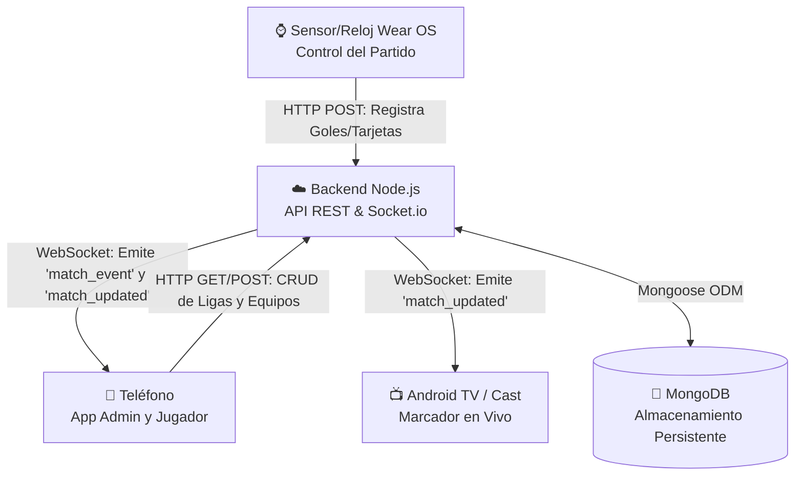
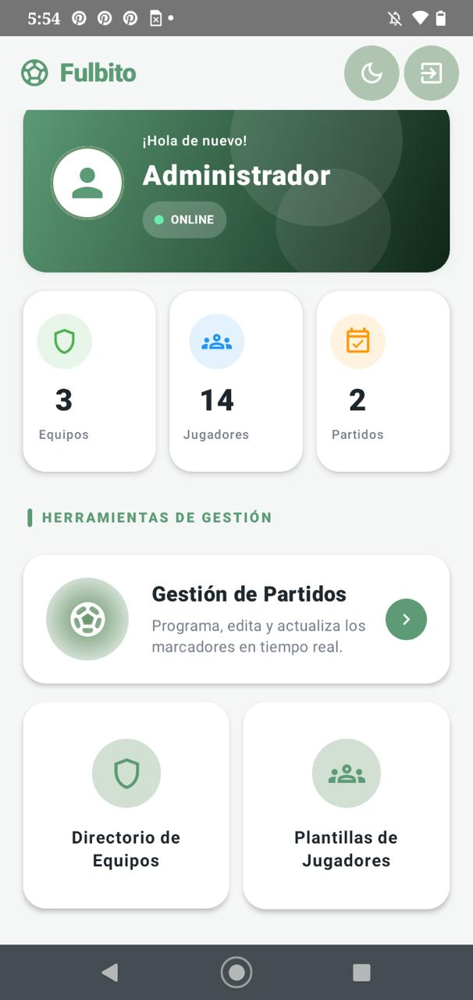
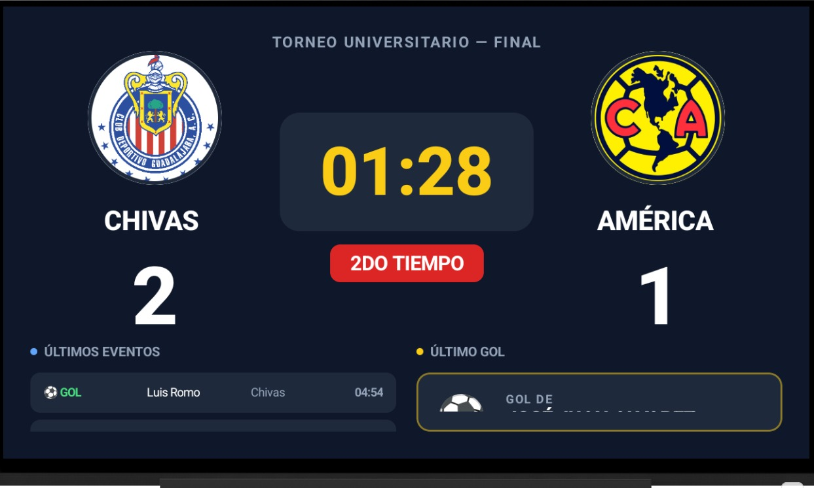

# ⚽ Tracker de Partidos - Fulbito 360

<p align="center">
  
  
  
  
  
  
  
  
</p>

**Fulbito** es una solución integral y distribuida para la gestión de partidos de fútbol en tiempo real, diseñada específicamente para funcionar en perfecta sincronía a través del ecosistema **Wear OS, Android Móvil y Android TV**. 

### 🎯 Beneficiario del Proyecto
Esta aplicación está dirigida a **Ligas de fútbol amateur, árbitros, capitanes de equipo y aficionados**. 
Resuelve la ineficiencia de la gestión manual de los partidos proporcionando un flujo digital donde:
- ⌚ **El árbitro** controla el partido sin sacar el celular, directamente desde su muñeca.
- 📱 **Los administradores y jugadores** revisan el rendimiento, las tarjetas y los goles en su teléfono.
- 📺 **Los espectadores** viven la experiencia visualizando el marcador del estadio actualizado en vivo desde una pantalla grande.

---

## 🏗️ Diagrama de Arquitectura de Sistemas

El flujo de información de la aplicación es impulsado por eventos de baja latencia a través de WebSockets:


```mermaid
graph TD
    A[⌚ Sensor/Reloj Wear OS\nControl del Partido] -->|HTTP POST: Registra Goles/Tarjetas| B[☁️ Backend Node.js\nAPI REST & Socket.io]
    B -->|WebSocket: Emite 'match_event' y 'match_updated'| C[📱 Teléfono\nApp Admin y Jugador]
    B -->|WebSocket: Emite 'match_updated'| D[📺 Android TV / Cast\nMarcador en Vivo]
    C -->|HTTP GET/POST: CRUD de Ligas y Equipos| B
    B <-->|Mongoose ODM| E[(🍃 MongoDB\nAlmacenamiento Persistente)]
```

---

## ✨ Características Principales

- **⏱️ Cronómetro Inteligente (Wear OS):** Control total del tiempo de juego (pausa, reanudación, cambio de periodos y término del partido) optimizado para bajo consumo de batería.
- **⚽ Marcador y Eventos en Vivo:** Registro instantáneo de goles, tarjetas amarillas y rojas con asociación directa a jugadores y equipos.
- **🔔 Notificaciones Push Locales:** El teléfono recibe alertas nativas instantáneas vía Socket.io cuando ocurre un gol o el árbitro expulsa a un jugador en el campo.
- **📊 Radar de Rendimiento:** Gráficos de estadísticas dibujados dinámicamente (`Canvas`) para los jugadores, evaluando goles, tarjetas y participación.
- **🖼️ Gestión de Multimedia:** Subida de escudos y logotipos al servidor usando peticiones `Multipart`.

---

<div align="center">

## 📸 Capturas de Pantalla

### ⌚ Wear OS (Reloj Árbitro)


### 📱 App Móvil (Teléfono Admin/Jugador)



### 📺 Pantalla (Android TV)



</div>

---

## 🛠️ Stack Tecnológico

El proyecto está diseñado usando los paradigmas más modernos de desarrollo móvil (Programación Declarativa y Arquitectura Unidireccional).

### **Frontend (Mobile, Wearable & TV)**
- **Kotlin:** Lenguaje principal 100% moderno y seguro contra nulos.
- **Arquitectura MVVM:** Separación limpia de la vista y la lógica de negocio (Model-View-ViewModel).
- **Jetpack Compose:** Interfaz gráfica 100% declarativa para los tres dispositivos (Mobile, Wear OS y TV).
- **Corrutinas y StateFlow:** Manejo asíncrono avanzado y estado reactivo.
- **Retrofit & OkHttp:** Cliente HTTP seguro para el consumo de la API REST y subida Multipart.
- **Socket.io Client:** Conexión persistente por WebSockets para el tiempo real.
- **Coil:** Carga de imágenes asíncronas optimizada por caché en disco y memoria.

### **Backend & Base de Datos**
- **Node.js + Express:** Servidor web rápido, no bloqueante y ligero.
- **Socket.io:** Motor de eventos bidireccional de baja latencia.
- **MongoDB + Mongoose:** Base de datos NoSQL flexible, ideal para esquemas de torneos.
- **Bcrypt:** Encriptación de contraseñas por seguridad.

---

## 📂 Estructura a Nivel de Módulos (Android)

Este es un proyecto multiproyecto de Gradle que compila tres aplicaciones diferentes desde el mismo código fuente:

1. **`app/` (Módulo Wear OS):**
   Contiene pantallas circulares diseñadas específicamente para el reloj. Prioriza la rapidez de interacción, botones grandes para que el árbitro pueda presionar sin mirar fijamente, y rutinas de cronómetro que sobreviven al apagado de pantalla.
2. **`fulbitoapp/` (Módulo Teléfono):**
   Es la aplicación de gestión. Maneja autenticación de usuarios (roles Admin/Player), creación de ligas, alta de jugadores con subida de fotos (Multipart) y dibuja dashboards con Jetpack Compose Canvas. Contiene un *Servicio de Notificaciones* que despierta al recibir un gol vía Socket.
3. **`fulbitotv/` (Módulo Android TV):**
   Interfaz pasiva (Solo Lectura) altamente optimizada para pantallas gigantes. Se conecta al Socket.io y reacciona actualizando el marcador automáticamente cuando el backend emite un evento `match_updated`. No requiere interacción con control remoto.

---

##  Arquitectura Interna del Frontend (Patrón MVVM)

El código fuente de las aplicaciones Android sigue rigurosamente el patrón **MVVM (Model-View-ViewModel)** recomendado por Google, asegurando un código escalable y fácil de mantener:

1. **Capa de Datos (Data Layer - `data/remote/`)**:
   - `ApiService.kt`: Interfaz de Retrofit que mapea los endpoints REST (GET, POST, PUT, DELETE).
   - `SocketManager.kt`: Singleton que mantiene viva la conexión WebSocket para recibir los eventos en tiempo real (`match_event`, `match_finished`).
   - `Models.kt` / `AuthModels.kt`: Data classes de Kotlin que representan la estructura JSON de la base de datos MongoDB.

2. **Capa de Estado y Lógica (ViewModel Layer - `presentation/`)**:
   - `AdminViewModel.kt`: Mantiene el estado global de Ligas, Equipos y Partidos usando `StateFlow`. Expone funciones asíncronas mediante Corrutinas (`viewModelScope.launch`) para enviar datos al servidor.
   - `PlayerViewModel.kt`: Gestiona la descarga de estadísticas del jugador y procesa la información de capitanía.
   - `TvViewModel.kt`: Se suscribe a los eventos del socket y actualiza el marcador en vivo.

3. **Capa de Presentación (UI Layer - `presentation/screens/`)**:
   - Construida 100% con **Jetpack Compose**. Las pantallas reaccionan automáticamente y se recomponen ante los cambios de los `StateFlow` del ViewModel.
   - Componentes matemáticos avanzados como el `RadarChart` dibujado a la medida usando el `Canvas` nativo de Compose.
   - `AppNavigation.kt`: Define el grafo de navegación usando `Navigation Compose`, asegurando el ruteo seguro entre pantallas.

##  Librerías Android Utilizadas

- **Retrofit2 & OkHttp3**: Estándar para peticiones HTTP eficientes. Soporte para peticiones `Multipart` (subida de imágenes).
- **Socket.io-client**: Cliente nativo para Android que permite la recepción de eventos del servidor en cuestión de milisegundos.
- **Coil-Compose**: Sistema moderno de carga de imágenes asíncronas con soporte avanzado para caché en disco y memoria.
- **Material Design 3**: Implementación de temas dinámicos (Claro/Oscuro) y componentes de UI fluidos.

---

## 🚀 Instalación y Configuración Detallada

Para ejecutar este ecosistema localmente, necesitas **Node.js**, **MongoDB** y **Android Studio**.

### Paso 1: Levantar el Backend (Servidor)
1. Abre una terminal y navega a la carpeta del servidor: 
   ```bash
   cd fulbito-backend
   ```
2. Instala las dependencias necesarias:
   ```bash
   npm install
   ```
3. Ejecuta el servidor (por defecto en el puerto `3000`):
   ```bash
   npm run dev
   ```
   *(Asegúrate de tener el servicio de MongoDB corriendo localmente o proporciona una URI de Mongo Atlas en tu código).*

### Paso 2: Configurar el Frontend (Android)
1. Abre **Android Studio**.
2. Selecciona *Open* y elige la carpeta `fulbit-F/Fulbito/`.
3. Espera a que Gradle sincronice todas las librerías.
4. **Configuración Crítica de Red:** 
   - Ve al archivo `ApiConfig.kt` (ubicado dentro de la carpeta `data/remote/` de cada módulo).
   - Cambia la variable `BASE_URL` por la **dirección IP real de tu computadora** en tu red Wi-Fi (Ej: `http://192.168.1.11:3000/api`). *Nunca dejes localhost si vas a probar en dispositivos físicos.*

### Paso 3: Compilación y Ejecución
- En la barra superior de Android Studio, encontrarás un menú desplegable de "Run Configurations".
- Selecciona el módulo que deseas probar (`app`, `fulbitoapp`, o `fulbitotv`).
- Selecciona el emulador adecuado o conecta tu celular/reloj por cable o depuración inalámbrica.
- Presiona **Run (▶)**.

---
<p align="center">
  <i>Desarrollado para el proyecto final de cuatrimestre por:</i><br>
  <b>Santiago Ronaldo Chavez Piñón | César Fernando González Avalos | Leonel Alejandro Torres Perez</b><br>
  <i>UTNG - Grupo GIDS6093</i>
</p>

## Resumen Gráfico de Arquitectura

