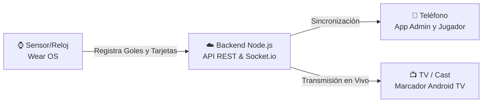
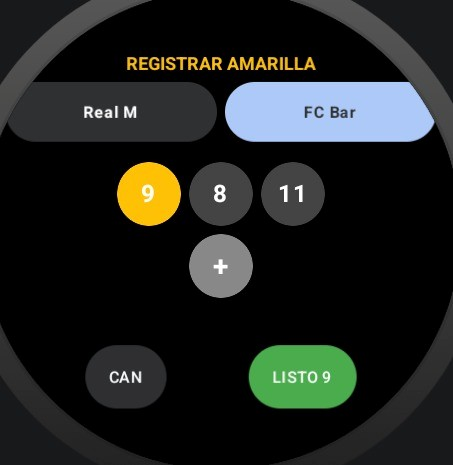

#   Tracker de Partidos para Wear OS

  
  
  
  
  
  

**Fulbito** es una solución integral para la gestión de partidos de fútbol en tiempo real, diseñada específicamente para el ecosistema **Wear OS, Android Móvil y Android TV**. 

### 🎯 Beneficiario del Proyecto
Esta aplicación está dirigida a **Ligas de fútbol amateur, árbitros y capitanes de equipo**. Resuelve el problema de la gestión manual del partido al proporcionar una herramienta digital que el árbitro puede usar directamente desde su muñeca (reloj), mientras que los capitanes pueden ver sus estadísticas en el teléfono y los espectadores pueden ver el marcador en tiempo real en una pantalla (Android TV o Cast).

---

##  Diagrama de Arquitectura

El flujo de información de la aplicación funciona de la siguiente manera:

```mermaid
graph LR
    A[⌚ Sensor/Reloj\nWear OS] -->|Registra Goles y Tarjetas| B[☁️ Backend Node.js\nAPI REST & Socket.io]
    B -->|Sincronización| C[📱 Teléfono\nApp Admin y Jugador]
    B -->|Transmisión en Vivo| D[📺 TV / Cast\nMarcador Android TV]
```

---

##  Características Principales

- **⏱️ Cronómetro Inteligente:** Control total del tiempo de juego (pausa, reanudación y cambio de periodos).
- **⚽ Marcador en Vivo:** Registro instantáneo de goles para local y visitante.
- **🟨 Gestión de Sanciones:** Registro rápido de tarjetas amarillas y rojas.
- **📜 Historial de Eventos:** Consulta todos los sucesos del partido cronológicamente.
- **🔄 Sincronización Real-time:** Conexión con API REST y Socket.io para actualizaciones en vivo.
- **🎨 UI Optimizada:** Interfaz adaptada para pantallas circulares, teléfonos y TV con Jetpack Compose.

---

## 📸 Capturas de Pantalla

### Wear OS (Reloj)

### App Móvil (Teléfono)
> 
<!-- Reemplaza el link con tu imagen -->

### Pantalla / Android TV

<!-- Reemplaza el link con tu imagen -->

---

##  Stack Tecnológico

### **Frontend (Mobile/Wearable)**
- **Kotlin:** Lenguaje de última generación para Android.
- **Jetpack Compose for Wear OS:** UI declarativa y moderna.
- **Room Persistence:** Caché local para funcionamiento offline.
- **Retrofit & OkHttp:** Comunicación eficiente con la API.

### **Backend & Base de Datos**
- **Node.js:** Entorno de ejecución para el servidor.
- **Express:** Framework para la creación de la API REST.
- **MongoDB:** Base de datos NoSQL para almacenamiento flexible de encuentros.

---

##  Instalación y Configuración

1. **Backend:** Asegúrate de tener el servidor Node.js corriendo (por defecto en el puerto `3000`).
2. **Clonación:** `git clone https://github.com/tu-usuario/fulbito.git`
3. **Android Studio:** Abre el proyecto y sincroniza Gradle.
4. **Configuración de IP:** Si usas un dispositivo físico, cambia `BASE_URL` en `RetrofitClient.kt` por la IP de tu servidor.
5. **Ejecución:** Selecciona un emulador de Wear OS o un reloj físico y presiona `Run`.

---

  <i>Desarrollado para el proyecto de la UTNG_Chavez Piñón Santiago Ronaldo_González Avalos César Fernando_Torres Perez Leonel Alejandro</i>

  <i>Grupo GIDS6093</i>

## Arquitectura de la aplicación

